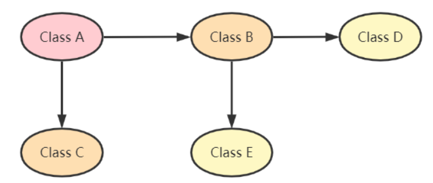
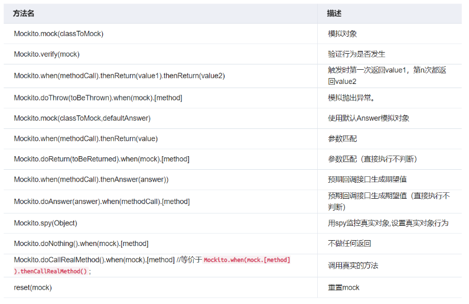

# Mockito实战指南

## 1. Mockito简介

### 1.1 Mockito是什么

Mockito是Java流行的一种Mock框架，使用Mock技术能让我们隔离外部依赖以便对我们自己的业务逻辑代码进行单元测试，在编写单元测试时，不需要再进行繁琐的初始化工作，在需要调用某一个接口时，直接模拟一个假方法，并任意指定方法的返回值。Mockito的工作原理是通过创建依赖对象的proxy，所有的调用先经过proxy对象，proxy对象拦截了所有的请求再根据预设的返回值进行处理。

官网： https://site.mockito.org/

文档：https://javadoc.io/doc/org.mockito/mockito-core/latest/org/mockito/Mockito.html

github源码： https://github.com/mockito/mockito

### 1.2 为什么需要Mock

测试驱动的开发( TDD)
要求我们先写单元测试，再写实现代码。在写单元测试的过程中，我们往往会遇到要测试的类有很多依赖，这些依赖的类/对象/资源又有别的依赖，从而形成一个大的依赖树，要在单元测试的环境中完整地构建这样的依赖，是一件很困难的事情。如下图所示：



为了测试类A，我们需要Mock B类和C类（用虚拟对象来代替）如下图所示：


## 2. Mockito的使用

### 环境配置

要使用 Mockito，首先需要在我们的项目中引入 Mockito 测试框架依赖，基于 Maven 构建的项目引入如下依赖即可：

```xml

<dependency>
    <groupId>org.mockito</groupId>
    <artifactId>mockito-core</artifactId>
    <version>4.5.1</version>
    <scope>test</scope>
</dependency>
```

SpringBoot集成了mockito，只需要在 pom.xml 文件中添加依赖：

如果使用Gradle，添加以下依赖：

```xml

<dependency>
    <groupId>org.springframework.boot</groupId>
    <artifactId>spring‐boot‐starter‐test</artifactId>
    <scope>test</scope>
</dependency>
```

### mockito常用API



测试中我们创建的对象一般可以分为三种：被测对象、mock对象和spy对象。

- **被测对象**：即我们想要测试的对象，比如xxService、xxUtils等。
- **mock对象**：一般为我们被测对象的依赖对象。典型如被测对象的成员变量。主要是一些测试中我们不关注的对象。我们只想要得到这些对象的方法的返回值。而不
  关注这些方法的具体执行逻辑。此时我们可以将这些对象创建为mock对象。
- **spy对象**：在Mockito中它是基于部分mock概念提出的。spy对象也可由mock对象使用特定参数下创建。也就是说：spy对象其实是一种特殊的mock对象。和mock对象一样，它可以作为被测对象的依赖对象。此时
  **它和mock对象的最大的区别是mock对象的方法如果没有被存根，调用时会返回相应对象的空值；而spy对象的方法被调用时则会调用真实的代码逻辑
  **。

### 2.1 创建mock对象

使用 Mockito 通常有两种常见的方式来创建 Mock 对象。

#### **使用 Mockito.mock(clazz) 方式**

通过 Mockito 类的静态方法 mock 来创建 Mock 对象，例如以下创建了一个 List 类型的Mock对象：

```java
List<String> mockedList = Mockito.mock(List.class);
```

由于 mock 方法是一个静态方法，所以通常会写成静态导入方法的方式，即 `List<String> mockList = mock(ArrayList.class)`。

#### **使用 @Mock 注解方式**

第二种方式就是使用 @Mock 注解方式来创建 Mock 对象，使用该方式创需要注意的是要在运行测试方法前使用
`MockitoAnnotations.initMocks(this)` 或者单元测试类上加上 `@ExtendWith(MockitoExtension.class)` 注解，如下所示代码创建了一个
List 类型的 Mock 对象

```java
 //@ExtendWith(MockitoExtension.class)
public class MockitoTest {

    @Mock
    private List<String> mockList;

    @BeforeEach
    public void beforeEach() {
        MockitoAnnotations.initMocks(this);
    }
}

```

### 2.2 验证性测试

Mockito 测试框架中提供了 Mockito.verify 静态方法让我们可以方便的进行验证性测试， 比如方法调用验证、方法调用次数验证、方法调用顺序验证等，下面看看具体的代码。

#### **验证方法单次调用**

验证方法单次调用的话直接 verify 方法后加上待验证调用方法即可，以下代码的功能就是验证 mockList 对象的 size 方法被调用一次。

```java

@ExtendWith(MockitoExtension.class)
public class MockitoVerifyTest {

    @Mock
    List<String> mockList;

    @Test
    void verify_SimpleInvocationOnMock() {
        mockList.size();
        verify(mockList).size();
    }
}

```

#### **验证方法调用指定次数**

除了验证单次调用，我们有时候还需要验证一些方法被调用多次或者指定的次数，那么此时就可以使用 verify + times
方法来验证方法调用指定次数，同时还可以结合 atLeast + atMost 方法来提供调用次数范围，同时还有 never 等方法验证不被调用等。

```java

@ExtendWith(MockitoExtension.class)
public class MockitoVerifyTest {

    @Mock
    List<String> mockList;

    @Test
    void verify_NumberOfInteractionsWithMock() {
        mockList.size();
        mockList.size();

        verify(mockList, times(2)).size();
        verify(mockList, atLeast(1)).size();
        verify(mockList, atMost(10)).size();`
    }
}

```

校验次数方法常用的有如下几个：

| Method        | Meaning             |
|---------------|---------------------|
| times(n)      | 次数为n，默认为1（times(1)） |
| never()       | 次数为0，相当于times(0)    |
| atLeast(n)    | 最少n次                |
| atLeastOnce() | 最少一次                |
| atMost(n)     | 最多n次                |

#### **验证方法调用顺序**

同时还可以使用 inOrder 方法来验证方法的调用顺序，下面示例验证 mockList 对象的 size、add 和 clear 方法的调用顺序。

```java

@ExtendWith(MockitoExtension.class)
public class MockitoVerifyTest {

    @Mock
    List<String> mockList;

    @Test
    void verify_OrderedInvocationsOnMock() {
        mockList.size();
        mockList.add("add a parameter");
        mockList.clear();

        InOrder inOrder = inOrder(mockList);

        inOrder.verify(mockList).size();
        inOrder.verify(mockList).add("add a parameter");
        inOrder.verify(mockList).clear();
    }
}
```

#### **验证方法异常**

异常测试我们需要使用 Mockito 框架提供的一些调用行为定义，Mockito 提供了 when(...).thenXXX(...) 来让我们定义方法调用行为，以下代码定义了当调用
mockMap 的 get 方法无论传入任何参数都会抛出一个空指针 NullPointerException 异常，然后通过 Assertions.assertThrows
来验证调用结果。

```java

@ExtendWith(MockitoExtension.class)
public class MockitoExceptionTest {

    @Mock
    public Map<String, Integer> mockMap;

    @Test
    public void whenConfigNonVoidReturnMethodToThrowEx_thenExIsThrown() {
        when(mockMap.get(anyString())).thenThrow(NullPointerException.class);
        assertThrows(NullPointerException.class, () ‐ > mockMap.get("fox"));
    }
}
```

同时 when(...).thenXXX(...) 不仅可以定义方法调用抛出异常，还可以定义调用方法后的返回结果，比如 when(mockMap.get("fox"))
.thenReturn(21); 定义了当我们调用mockMap 的 get 方法并传入参数 mghio 时的返回结果是 21。这里有一点需要注意，使用以上这种方式定义的
mock 对象测试实际并不会影响到对象的内部状态，如下图所示：

```java

@ExtendWith(MockitoExtension.class)
public class MockitoTest {

    @Mock
    List<String> mockList;

    @Test
    void verify_SimpleInvocationOnMock() {

        mockList.add("add a parameter");

        assertEquals(0, mockList.size());

    }
}
```

虽然我们已经在 mockList 对象上调用了 add 方法，但是实际上 mockList 集合中并没有 加入fox，这时候如果需要对 mock
对象有影响，那么需要使用 spy 方式来生成 mock 对象。

```java

@ExtendWith(MockitoExtension.class)
public class MockitoTest {

    private List<String> mockList = spy(ArrayList.class);

    @Test
    void verify_SimpleInvocationOnMock() {

        mockList.add("fox");
        assertEquals(0, mockList.size());

    }
}
```

### 2.3 与 Spring 框架集成

Mockito 框架提供了 @MockBean 注解用来将 mock 对象注入到 Spring 容器中，该对象会替换容器中任何现有的相同类型的
bean，该注解在需要模拟特定bean（例如外部服务）的测试场景中很有用。如果使用的是 Spring Boot 2.0+ 并且当前容器中已有相同类型的
bean 的时候，需要设置 `spring.main.allow-bean-definition-overriding` 为 true（默认为 false）允许 bean 定义覆盖。

下面假设要测试通过用户编码查询用户的信息，有一个数据库操作层的 UserRepository，也就是我们等下要 mock 的对象，定义如下：

```java

@Repository
public interface UserRepository {

    User findUserById(Long id);

}

```

还有用户操作的相关服务 UserService 类，其定义如下所示:

```java

@Service
public class UserService {

    private UserRepository userRepository;

    public UserService(UserRepository userRepository) {
        this.userRepository = userRepository;
    }

    public User findUserById(Long id) {
        return userRepository.findUserById(id);
    }
}
```

在测试类中使用 @MockBean 来标注 UserRepository 属性表示这个类型的 bean 使用的是 mock 对象，使用 @Autowired 标注表示
UserService 属性使用的是 Spring 容器中的对象，然后使用 @SpringBootTest 启用 Spring 环境即可。

```java

@SpringBootTest
public class UserServiceUnitTest {

    @Autowired
    private UserService userService;

    @MockBean
    private UserRepository userRepository;

    @Test
    public void whenUserIdIsProvided_thenRetrievedNameIsCorrect() {
        User expectedUser = new User(9527L, "fox", "长沙");
        when(userRepository.findUserById(9527L)).thenReturn(expectedUser);
        User actualUser = userService.findUserById(9527L);
        assertEquals(expectedUser, actualUser);
    }
}
```

### 2.4 高级特性

#### **静态方法Mock**

Mockito 3.4.0版本之后支持mock静态方法，需要使用MockedStatic来实现：

```java
public class StaticUtils {
    public static String getStaticMessage() {
        return "Hello Static";
    }
}

@Test
void mockStaticMethod() {
    try (MockedStatic<StaticUtils> utilities = mockStatic(StaticUtils.class)) {
        utilities.when(StaticUtils::getStaticMessage).thenReturn("Hello Mock");
        assertEquals("Hello Mock", StaticUtils.getStaticMessage());
    }
}
```

#### **Final方法Mock**

Mockito支持mock final方法和final类，不需要额外配置：

```java
public final class FinalClass {
    public final String getFinalMessage() {
        return "Hello Final";
    }
}

@Test
void mockFinalMethod() {
    FinalClass finalClass = mock(FinalClass.class);
    when(finalClass.getFinalMessage()).thenReturn("Hello Mock");
    assertEquals("Hello Mock", finalClass.getFinalMessage());
}
```

#### **私有方法Mock**

对于私有方法，我们可以使用PowerMockito来实现mock：

```java

@RunWith(PowerMockRunner.class)
@PrepareForTest(ClassWithPrivateMethod.class)
public class PrivateMethodTest {

    @Test
    public void testPrivateMethod() throws Exception {
        ClassWithPrivateMethod mock = spy(new ClassWithPrivateMethod());
        doReturn("mocked").when(mock, "privateMethod");
        assertEquals("mocked", mock.publicMethod());
    }
}
```

#### **参数捕获**

使用ArgumentCaptor可以捕获方法调用时传入的参数：

```java

@Test
public void captureArgument() {
    List<String> list = mock(List.class);
    ArgumentCaptor<String> argument = ArgumentCaptor.forClass(String.class);
    list.add("Hello");
    verify(list).add(argument.capture());
    assertEquals("Hello", argument.getValue());
}
```

#### **Answer机制**

Answer允许我们自定义mock方法的行为：

```java

@Test
public void answerTest() {
    List<String> mock = mock(List.class);
    when(mock.get(anyInt())).thenAnswer(invocation -> {
        Integer index = invocation.getArgument(0);
        return "Answer " + index;
    });
    assertEquals("Answer 0", mock.get(0));
    assertEquals("Answer 1", mock.get(1));
}
```

#### **连续调用**

可以为同一个方法设置连续调用时的不同返回值：

```java

@Test
public void consecutiveCallsTest() {
    Iterator<String> mock = mock(Iterator.class);
    when(mock.next())
            .thenReturn("first")
            .thenReturn("second")
            .thenReturn("third");

    assertEquals("first", mock.next());
    assertEquals("second", mock.next());
    assertEquals("third", mock.next());
}
```

### 2.5 实战案例

#### **Mock数据库连接**

```java

@Test
public void mockDatabaseConnection() throws SQLException {
    Connection connection = mock(Connection.class);
    PreparedStatement statement = mock(PreparedStatement.class);
    ResultSet resultSet = mock(ResultSet.class);

    when(connection.prepareStatement(anyString())).thenReturn(statement);
    when(statement.executeQuery()).thenReturn(resultSet);
    when(resultSet.next()).thenReturn(true, false);
    when(resultSet.getString("name")).thenReturn("John");

    // 使用mock的数据库连接
    assertEquals("John", getUserName(connection));
}
```

#### **Mock HTTP请求**

```java

@Test
public void mockHttpRequest() throws Exception {
    HttpClient httpClient = mock(HttpClient.class);
    HttpResponse response = mock(HttpResponse.class);
    StatusLine statusLine = mock(StatusLine.class);

    when(statusLine.getStatusCode()).thenReturn(200);
    when(response.getStatusLine()).thenReturn(statusLine);
    when(httpClient.execute(any(HttpGet.class))).thenReturn(response);

    // 使用mock的HTTP客户端
    assertEquals(200, getResponseStatus(httpClient));
}
```

#### **Mock定时任务**

```java

@Test
public void mockScheduledTask() {
    ScheduledExecutorService executor = mock(ScheduledExecutorService.class);
    when(executor.scheduleAtFixedRate(
            any(Runnable.class),
            anyLong(),
            anyLong(),
            any(TimeUnit.class)
    )).thenReturn(null);

    // 验证定时任务的调度
    startScheduledTask(executor);
    verify(executor).scheduleAtFixedRate(
            any(Runnable.class),
            eq(0L),
            eq(1L),
            eq(TimeUnit.SECONDS)
    );
}
```

#### **模拟方法内部调用**

有时我们需要模拟方法内部的new对象操作或静态代码块：

```java

@Test
public void mockInternalMethodCalls() {
    // 模拟构造函数
    whenNew(MyClass.class).withNoArguments().thenReturn(mockedObject);

    // 模拟静态代码块
    mockStatic(MyClass.class);
    when(MyClass.staticMethod()).thenReturn("mocked");
}
```

#### **Answer机制深入解析**

thenAnswer和doAnswer的主要区别：

- thenAnswer用于有返回值的方法
- doAnswer用于void方法

```java

@Test
public void advancedAnswerTest() {
    List<String> mock = mock(List.class);

    // thenAnswer示例
    when(mock.get(anyInt())).thenAnswer(invocation -> {
        int index = invocation.getArgument(0);
        return String.format("Element at %d", index);
    });

    // doAnswer示例
    doAnswer(invocation -> {
        String arg = invocation.getArgument(0);
        System.out.println("Adding: " + arg);
        return null;
    }).when(mock).add(anyString());
}
```

#### **更多实战案例**

**模拟Spring ApplicationContext**

```java

@Test
public void mockApplicationContext() {
    ApplicationContext context = mock(ApplicationContext.class);
    MyService service = mock(MyService.class);
    when(context.getBean(MyService.class)).thenReturn(service);

    // 使用模拟的ApplicationContext
    MyController controller = new MyController(context);
    controller.doSomething();
}
```

**模拟RestTemplate请求**

```java

@Test
public void mockRestTemplate() {
    RestTemplate restTemplate = mock(RestTemplate.class);
    ResponseEntity<String> response = new ResponseEntity<>("success", HttpStatus.OK);

    when(restTemplate.exchange(
            anyString(),
            eq(HttpMethod.POST),
            any(HttpEntity.class),
            eq(String.class)
    )).thenReturn(response);

    // 使用模拟的RestTemplate
    MyApiClient client = new MyApiClient(restTemplate);
    assertEquals("success", client.callApi());
}
```

**模拟异步任务**

```java

@Test
public void mockAsyncTask() {
    CompletableFuture<String> future = mock(CompletableFuture.class);
    when(future.get()).thenReturn("async result");

    AsyncService service = mock(AsyncService.class);
    when(service.asyncOperation()).thenReturn(future);

    // 验证异步操作
    assertEquals("async result", service.asyncOperation().get());
}
```

#### **常见问题解决方案**

**1. 模拟私有方法失败**

```java

@RunWith(PowerMockRunner.class)
@PrepareForTest(ClassWithPrivateMethod.class)
public class PrivateMethodTest {
    @Test
    public void mockPrivateMethod() throws Exception {
        ClassWithPrivateMethod spy = spy(new ClassWithPrivateMethod());
        PowerMockito.when(spy, "privateMethod").thenReturn("mocked");
        assertEquals("mocked", spy.publicMethod());
    }
}
```

**2. Final类mock失败**

```java
// 在src/test/resources/mockito-extensions/org.mockito.plugins.MockMaker文件中添加：
// mock-maker-inline

@Test
public void mockFinalClass() {
    FinalClass mock = mock(FinalClass.class);
    when(mock.finalMethod()).thenReturn("mocked");
    assertEquals("mocked", mock.finalMethod());
}
```

**3. 静态方法mock失败**

```java

@Test
public void mockStaticMethod() {
    try (MockedStatic<Utility> utilities = mockStatic(Utility.class)) {
        utilities.when(() -> Utility.staticMethod()).thenReturn("mocked");
        assertEquals("mocked", Utility.staticMethod());
    }
}
```

### 2.6 更多高级特性

#### **模拟内部对象创建和Lambda表达式**

```java

@Test
public void mockNewObjectAndLambda() {
    // 模拟内部new对象
    whenNew(Helper.class).withAnyArguments().thenReturn(mockedHelper);

    // 模拟Lambda表达式
    Function<String, Integer> mock = mock(Function.class);
    when(mock.apply(anyString())).thenReturn(42);

    // 验证Lambda调用
    assertEquals(42, mock.apply("test"));
}
```

#### **Spring相关Mock案例**

```java
// 模拟Spring事件
@Test
public void mockSpringEvent() {
    ApplicationEventPublisher publisher = mock(ApplicationEventPublisher.class);
    doNothing().when(publisher).publishEvent(any(MyEvent.class));

    MyService service = new MyService(publisher);
    service.doSomething();

    verify(publisher).publishEvent(any(MyEvent.class));
}

// 模拟Spring缓存
@Test
public void mockSpringCache() {
    Cache cache = mock(Cache.class);
    when(cache.get(anyString())).thenReturn(null);
    when(cache.get(eq("key"), any())).thenReturn("value");

    CacheManager cacheManager = mock(CacheManager.class);
    when(cacheManager.getCache(anyString())).thenReturn(cache);
}

// 模拟Spring Security
@Test
public void mockSpringSecurity() {
    Authentication auth = mock(Authentication.class);
    SecurityContext securityContext = mock(SecurityContext.class);
    when(securityContext.getAuthentication()).thenReturn(auth);
    SecurityContextHolder.setContext(securityContext);
}
```

#### **复杂场景测试**

```java
// 多线程环境Mock
@Test
public void mockMultiThread() {
    CountDownLatch latch = new CountDownLatch(2);
    MyService service = mock(MyService.class);

    when(service.process()).thenAnswer(invocation -> {
        latch.countDown();
        return "result";
    });

    // 启动多个线程调用mock对象
    ExecutorService executor = Executors.newFixedThreadPool(2);
    executor.submit(() -> service.process());
    executor.submit(() -> service.process());

    latch.await(1, TimeUnit.SECONDS);
    verify(service, times(2)).process();
}

// 循环依赖Mock
@Testpublic
void mockCircularDependency() {
    ServiceA serviceA = mock(ServiceA.class);
    ServiceB serviceB = mock(ServiceB.class);

    when(serviceA.getB()).thenReturn(serviceB);
    when(serviceB.getA()).thenReturn(serviceA);

    assertSame(serviceB, serviceA.getB());
    assertSame(serviceA, serviceB.getA());
}

// 嵌套调用Mock
@Test
public void mockNestedCalls() {
    Service1 service1 = mock(Service1.class);
    Service2 service2 = mock(Service2.class);
    Service3 service3 = mock(Service3.class);

    when(service1.call()).thenReturn(service2);
    when(service2.process()).thenReturn(service3);
    when(service3.execute()).thenReturn("result");

    assertEquals("result", service1.call().process().execute());
}
```

### 2.7 性能优化

#### **减少Mock对象数量**

```java
// 不推荐：为每个依赖创建mock
@Test
public void badPractice() {
    Dependency1 dep1 = mock(Dependency1.class);
    Dependency2 dep2 = mock(Dependency2.class);
    Dependency3 dep3 = mock(Dependency3.class);
    // ...
}

// 推荐：只mock必要的依赖
@Test
public void goodPractice() {
    // 只mock真正需要的依赖
    MainDependency mainDep = mock(MainDependency.class);
}
```

#### **使用Spy代替Mock**

```java

@Test
public void useSpyForBetterPerformance() {
    // 使用spy保留真实对象的部分行为
    List<String> list = new ArrayList<>();
    List<String> spyList = spy(list);

    // 只mock需要特殊处理的方法
    when(spyList.size()).thenReturn(100);
}
```

#### **优化验证方式**

```java

@Test
public void optimizeVerification() {
    Service service = mock(Service.class);

    // 不推荐：频繁验证
    service.method1();
    verify(service).method1();
    service.method2();
    verify(service).method2();

    // 推荐：批量验证
    service.method1();
    service.method2();
    verify(service, times(1)).method1();
    verify(service, times(1)).method2();
}
```


